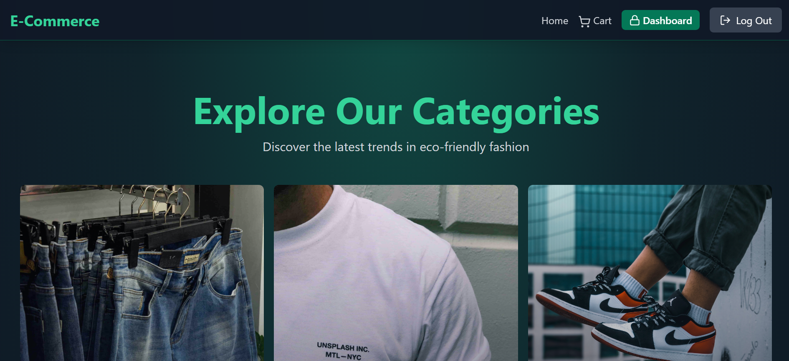
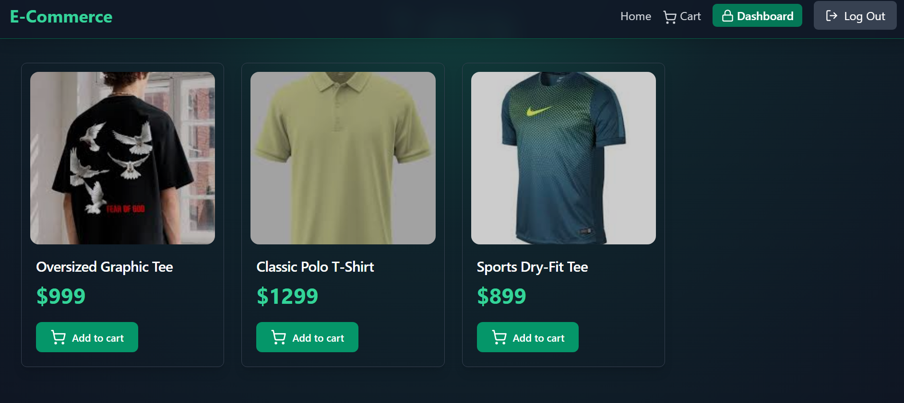
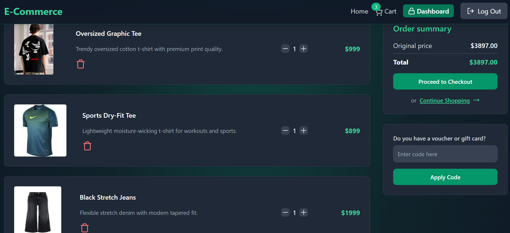
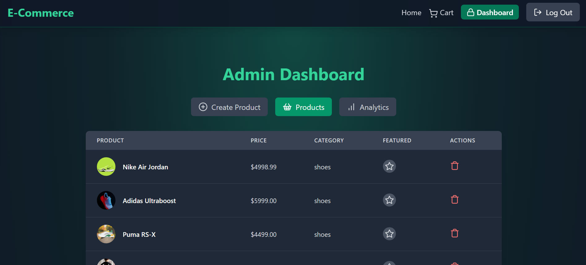
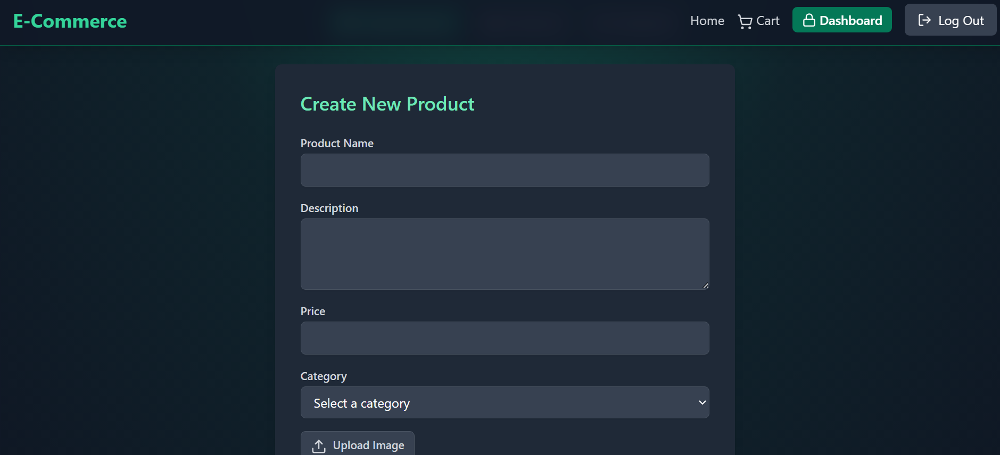

# 🛒 ShopSphere MERN

A modern full-stack E-Commerce web application built using the MERN Stack (MongoDB, Express.js, React.js, Node.js). ShopSphere provides a seamless online shopping experience with secure authentication, product management, shopping cart functionality, cloud-based image uploads, and an admin dashboard.

---

## 🚀 Live Demo

Frontend: Coming Soon

Backend API: Coming Soon

---

## 📌 Features

### 👤 User Features

* User Registration & Login
* JWT Authentication
* Secure Access & Refresh Tokens
* Browse Products
* View Product Details
* Add Products to Cart
* Manage Shopping Cart
* Coupon Code Support
* Responsive Design

### 👑 Admin Features

* Admin Dashboard
* Create Products
* Delete Products
* Manage Categories
* View Sales Analytics
* Upload Product Images
* Cloudinary Integration

### ⚡ Performance & Security

* JWT Authentication
* Protected Routes
* MongoDB Atlas Cloud Database
* Upstash Redis Caching
* Secure Cookie-Based Authentication
* Environment Variable Protection

---

## 🛠️ Tech Stack

### Frontend

* React.js
* Vite
* Tailwind CSS
* Zustand
* Axios
* React Router DOM

### Backend

* Node.js
* Express.js

### Database

* MongoDB Atlas

### Authentication

* JWT (Access Token & Refresh Token)

### Cloud Services

* Cloudinary
* Upstash Redis

### Deployment

* Vercel (Frontend)
* Render (Backend)

---

## 📸 Screenshots

### 🏠 Home Page



### 📦 Product Page



### 🛒 Cart Page



### 👑 Admin Dashboard



### ➕ Create Product Page



---

## ⚙️ Environment Variables

Create a `.env` file inside the backend directory.

```env
PORT=5000

MONGO_URI=your_mongodb_connection_string

UPSTASH_REDIS_URL=your_redis_url

ACCESS_TOKEN_SECRET=your_access_token_secret

REFRESH_TOKEN_SECRET=your_refresh_token_secret

CLOUDINARY_CLOUD_NAME=your_cloud_name

CLOUDINARY_API_KEY=your_api_key

CLOUDINARY_API_SECRET=your_api_secret

CLIENT_URL=http://localhost:5173

NODE_ENV=development
```

---

## 📂 Project Structure

```bash
ShopSphere/
│
├── backend/
│   ├── controllers/
│   ├── middleware/
│   ├── models/
│   ├── routes/
│   ├── lib/
│   └── server.js
│
├── frontend/
│   ├── src/
│   ├── public/
│   └── vite.config.js
│
├── screenshots/
│
└── README.md
```

---

## 🚀 Installation & Setup

### Clone Repository

```bash
git clone https://github.com/bnavinkumar/shopsphere-mern.git
```

### Install Dependencies

```bash
npm install
```

### Run Development Server

```bash
npm run dev
```

### Build Project

```bash
npm run build
```

### Start Production Server

```bash
npm run start
```

---

## 📊 Project Status

✅ MongoDB Atlas Connected

✅ Upstash Redis Configured

✅ Cloudinary Integration Working

✅ JWT Authentication Working

✅ Product Management Working

✅ Shopping Cart Working

✅ Admin Dashboard Working

✅ Product Image Upload Working

⚠️ Stripe Payment Integration Pending

---

## 🎯 Future Enhancements

* Stripe Payment Gateway
* Product Reviews & Ratings
* Wishlist Functionality
* Order Tracking
* Email Notifications
* AI Product Recommendations

---

## 👨‍💻 Developer

### Navin B

Final Year Computer Science and Engineering Student

SNS College of Technology

CGPA: 8.84 / 10

📧 Email: [nav77318@gmail.com](mailto:nav77318@gmail.com)

💼 LinkedIn: https://www.linkedin.com/in/bnavinkumar/

💻 GitHub: https://github.com/bnavinkumar

🧩 LeetCode: https://leetcode.com/u/_Navin_17/

---

## ⭐ Acknowledgement

This project was configured, customized, tested, deployed, and maintained as part of my Full Stack Development learning journey and portfolio development.
